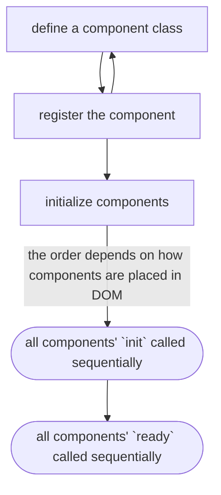

# Abs-Component

[](https://www.npmjs.com/package/abs-component) [](https://packagephobia.com/result?p=abs-component)


## Introduction:

This module allows you to define classes and associate an instance of them to an HTML node so that these nodes can behave as autonomous components.

Its implementation remains rather simple and the main goal in mind is to give users a basic way of organizing the scripts for different elements in a page, especially in small projects such as static websites.


## Development:

> Ignore this if you don't intend to contribute on the project

Make sure you have the Node version 15 or greater.

A simple `npm install` will get everything needed for development.

Edit files under `/src` folder.

Once tested, commited and pushed in a development branch it will be merged over to main branch (through pull request if needed) and a new dist build will be generated with `npm run build`.

The build is then pushed to remote together with package version increase and publish.

Development branch can then be realligned with main branch.


## Installation:

#### - As module
Install the module with your preferred package manager by typing the following in your terminal:
```
npm install -D abs-component
```
then import the module in your script
```typescript
import { AbsComponentManager } from 'abs-component';
```

#### - In browser

All available files are the following:
```bash
# Typescript
https://cdn.jsdelivr.net/npm/abs-component/dist/abs-component.ts

# Javascript
https://cdn.jsdelivr.net/npm/abs-component/dist/abs-component.js

# Javascript without exports
https://cdn.jsdelivr.net/npm/abs-component/dist/abs-component.nx.js
```

To include it for browser usage inser this in your `<head>`:
```html
<script src="https://cdn.jsdelivr.net/npm/abs-component@1/dist/abs-component.nx.js"></script>
```

> Remove `@1` after the package name from the link to load the latest version or specify the version by changing the number


## Component from the template side:

In HTML components are defined by simply applying a data-attribute to the desired node.
This attribute can be configured as preferred, else it's `data-abs-component` by default.

```html
<div data-abs-component="MyComponent"></div>
```


## Component from the logic side:

Be it Typescript or Javascript (the only difference is simply that TS has explicit interfaces available), the base structure of a component class is the same.

```javascript
// add `implements AbsComponent` for Typescript
class MyComponent {
  
  // The constructor receives an HTMLElement parameter
  // that is the DOM node reference
  // that the component is associated to

  // add `public` keyword to `node` for Typescript
  // recommended to add `readonly` keyword too to `node` for Typescript
  constructor (node) {}

  // All components are recommended to define an `init` function
  // but it's not required if know what to do
  init() {}

  // Then usually but optionally there is a `ready` function
  // (see the component lifecyle later in the README)
  ready() {
    this.myCustomMethod();
  }

  // And optionally, for unique use cases, a `destroy` function
  // NOTE: as of now components can only be destroyed manually
  destroy() {}

  // After these basic definitions you can start adding
  // additional methods to run custom logic

  myCustomMethod() {
    // For obtaining node references
    // contained inside the current component
    // you can use `this.node` as a starting node
    // to run a query selection
    const myComponentSubnode = this.node.querySelector('.my-component-subnode');
  }
}
```


## Usage example:

1) Firstly create an instance of the module class optionally passing to the constructor a config object with your preferred options.

```typescript
import { AbsComponentManager } from 'abs-component';
import { AbsComponentManagerConfig } from 'abs-component';

const absComponentManagerConfig: AbsComponentManagerConfig = {};
const absComponentManager = new AbsComponentManager(absComponentManagerConfig);
```

2) Define a component class

(I will build a switch button component to showcase a realistic yet simple example)

```typescript
import { AbsComponent } from 'abs-component';

interface ButtonComponent {
  onButtonNode: HTMLElement;
  offButtonNode: HTMLElement;
  state: boolean;
  BUTTON_ACTIVE_CLASS: string;
}

class SwitchComponent implements AbsComponent {
  constructor(public readonly node: HTMLElement) {}

  init(): void {
    this.onButtonNode = this.node.querySelector('button.on') as HTMLElement;
    this.offButtonNode = this.node.querySelector('button.off') as HTMLElement;
    this.state = false;
    this.BUTTON_ACTIVE_CLASS = 'active';
  }

  ready(): void {
    this.setButtonEvents();
  }

  setButtonEvents(): void {
    this.onButtonNode.addEventListener('click', () => {
      if(this.state !== true) {
        this.node.querySelector(`.${this.BUTTON_ACTIVE_CLASS}`).classList.remove(this.BUTTON_ACTIVE_CLASS);
        this.onButtonNode.classList.add(this.BUTTON_ACTIVE_CLASS);
        this.state = true;
        this.reportState();
      }
    });
    this.offButtonNode.addEventListener('click', () => {
      if(this.state !== false) {
        this.node.querySelector(`.${this.BUTTON_ACTIVE_CLASS}`).classList.remove(this.BUTTON_ACTIVE_CLASS);
        this.offButtonNode.classList.add(this.BUTTON_ACTIVE_CLASS);
        this.state = false;
        this.reportState();
      }
    });
  }

  reportState(): void {
    console.log(this.state);
  }
}
```

and its template will look something like this:

```html
<style>
  button.on.active,
  button.off.active {
    color: red;
  }
</style>

<div class="switch" data-abs-component="switch-component">
  <button class="on">ON</button>
  <button class="off">OFF</button>
</div>
```

3) Register your newly defined component, passing both the attribute value and the class

```typescript
absComponentManager.registerComponent('switch-component', SwitchComponent);
```

4) After all components are defined and registered, initialize them all together with a single method

```typescript
absComponentManager.initComponents();
```

> NOTE: do not confuse `initComponents` (plural) with `initComponent` (singular). This last one allows you to initialize a single component. It can be useful if components are printed at runtime.


Now we will have our HTML elements completely autonomous with their self-contained logic ready to be interacted with.


## Module lifecycle

The component initialization will select all HTML nodes having the component name data-attribute and call their `init()` method sequentially.
After all components have been inited the same will be done calling their `ready()` method.

> NOTE: if you want a component to interact with another writing code inside the `init()` method, one of the components may not exist yet depending on their order in the page. It is suggested to write inside `init()` for internal declarations and component preparation while the proper logic should go inside `ready()`;



## Component interactions

There is currently no well-structured way for components to communicate with each other but the module still offers a bare-minimum possibility.

The component manager offers a read only `components` object that looks like a record of names of registered components containing an array of how many instances of each component is present in the page.

```typescript
console.log(absComponentManager.components);

// log output
{
  'switch-component': [
    {
      init: Function,
      ready: Function,
      setButtonEvents: Function,
      reportState: Function,
      onButtonNode: HTMLElement,
      offButtonNode: HTMLElement,
      state: boolean,
      BUTTON_ACTIVE_CLASS: string
    }
  ]
}
```

Taking the previous example of a switch component we could say that a second component or any other script can access `SwitchComponent`'s parameters and methods using the following:

```typescript
// this is the component class
absComponentManager.components['switch-component'][0];

// the defined parameter containing `'active'`
absComponentManager.components['switch-component'][0].BUTTON_ACTIVE_CLASS;
```

> NOTE: depending on how the page behaves this method of accessing other componets may result unreliable as when a component is destroyed their class is removed from the array inside the `components` record list. If you have previously assigned a local reference to an external component then this reference will not be valid anymore.

An **additional and safer** method of obtaining a class reference of other components is using the `getComponentByNode` methods exposed by the component manager class.

If you have the exact node of the interested component, this function will run a search within the `components` object and return the class associated to that node.
